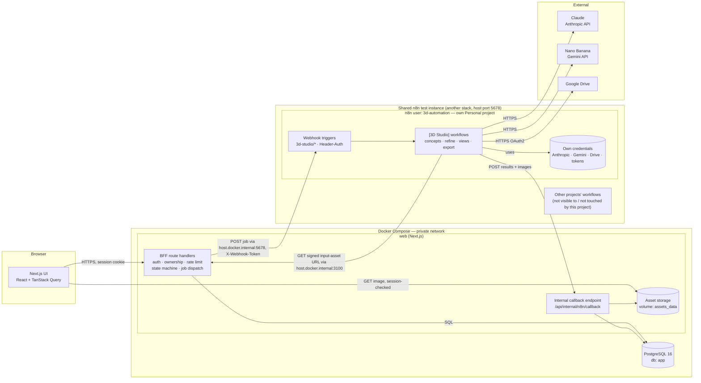
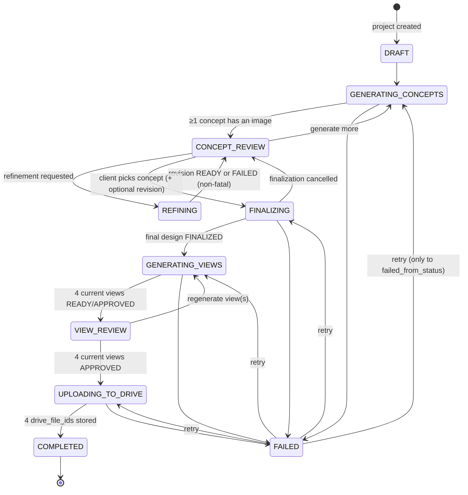
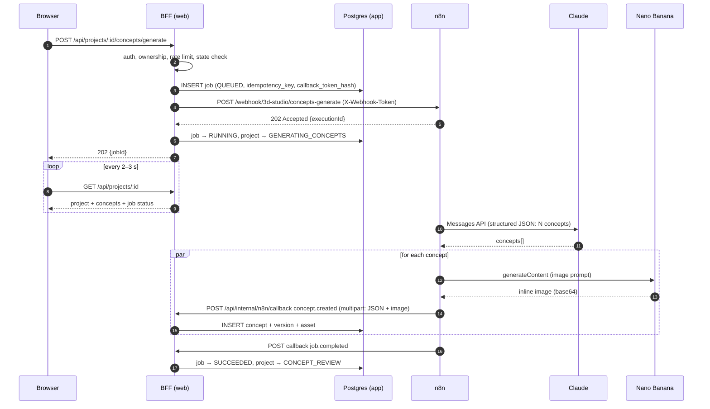
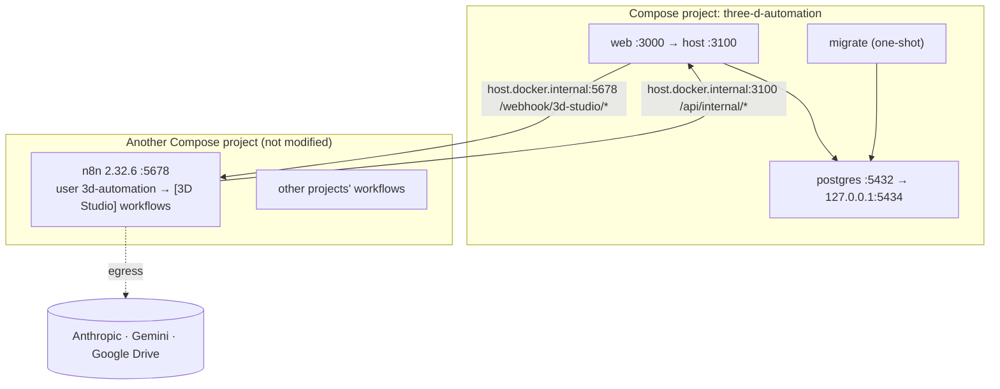

# Milestone 1 — Architecture Plan

**Product:** AI-powered 3D design ideation & approval platform
**Scope of this document:** Milestone 1 (idea → concepts → refinement → final design → 4 views → Google Drive)
**Status:** Proposed — audit complete, no implementation started
**Date:** 2026-10-04

---

## Table of contents

1. [Existing architecture (audit)](#1-existing-architecture-audit)
2. [Proposed architecture](#2-proposed-architecture)
3. [Component diagram](#3-component-diagram)
4. [Data flow](#4-data-flow)
5. [Database requirements](#5-database-requirements)
6. [n8n workflow architecture](#6-n8n-workflow-architecture)
7. [API / webhook architecture](#7-api--webhook-architecture)
8. [Google Drive structure](#8-google-drive-structure)
9. [Authentication / security approach](#9-authentication--security-approach)
10. [Environment variables](#10-environment-variables)
11. [Docker architecture](#11-docker-architecture)
12. [Testing strategy](#12-testing-strategy)
13. [Milestone 1 boundaries](#13-milestone-1-boundaries)
14. [Future Milestone 2 handoff requirements](#14-future-milestone-2-handoff-requirements)
15. [Appendix A — Proposed implementation sequence](#appendix-a--proposed-implementation-sequence)
16. [Appendix B — Open decisions](#appendix-b--open-decisions)
17. [Appendix C — Architectural risks](#appendix-c--architectural-risks)

---

## 1. Existing architecture (audit)

### 1.1 Repository contents

The project directory (`THE 3D AUTOMATION/`) is **empty**. There is no source code, no configuration, and it is **not a git repository**.

| Area | Finding | Reusable? |
|---|---|---|
| Frontend framework | None | — |
| Backend architecture | None | — |
| Database | None | — |
| Authentication | None | — |
| Package manager | None declared (no lockfile) | — |
| TypeScript configuration | None | — |
| Styling system | None | — |
| Existing API structure | None | — |
| Docker configuration | None (no `Dockerfile`, no `docker-compose.yml`) | — |
| Testing setup | None | — |
| Linting | None | — |
| Environment configuration | None (no `.env*` files) | — |
| Automation / integration code | None (no n8n workflow exports, no integration scripts) | — |

**Conclusion:** this is a **greenfield** project. There is no existing architecture to keep or replace. Every decision below is a new choice, and each one is made to keep the system small.

### 1.2 Host environment

The original development machine has Docker (Compose v2), Node.js 22 and pnpm installed. Other local projects already occupy the common ports, so the defaults chosen here are:

| Service | Default host port | Avoids |
|---|---|---|
| web | **3100** | 3000 (common Next.js / other apps) |
| n8n (project instance) | **5680** | 5678 (another n8n on the host) |
| Postgres | **5434** | 5432 / 5433 (other Postgres instances) |

All host ports can be overridden through `.env`. Machine-specific audit details are kept in a git-ignored local note (`docs/local/`) and are not part of this repository.

### 1.3 Shared n8n test instance

**Decision (from the project owner):** during development and testing, Milestone 1 workflows may be deployed **into an existing shared n8n instance** on the developer's machine, next to unrelated workflows. When the project is complete, the same workflows are deployed to the **n8n instance on the production VPS** (§6.7). The shared instance is a test target only. Two conditions apply:

- This is a **separate project for a different client**. Its workflows, credentials and error handling must be fully separate from every other project on the instance.
- The existing workflows are business-critical and must not be affected in any way.

§6.6 defines the separation and isolation rules.

A read-only audit of the shared instance (n8n public API, GET requests only) found the following. The consequences are what shapes this design:

| Property | Finding (generalised) | Consequence for this project |
|---|---|---|
| Ownership of the container | Belongs to another Compose stack | We **do not** modify, restart, re-create or pull it |
| Version | n8n **2.32.6**, image tag `latest` (unpinned) | It may upgrade silently. Our exports record 2.32.6 and the VPS pins the same version. See R12 |
| Database | SQLite, shared by all workflows on the instance | n8n state is **not** in our Postgres. We keep our execution footprint small (§6.6) |
| Exposure | Published beyond localhost | Every one of our webhooks **must** use Header Auth |
| Network | Its own Docker network | Our containers reach it via `host.docker.internal`. We do **not** attach to their network |
| Instance env | Defaults for binary data, payload size and pruning | We **cannot** change instance env. Our design must work with the current settings |
| Existing workflows | Dozens of active, business-critical workflows from other projects | Unique name prefix, tag, webhook namespace and credentials (§6.6) |
| Webhook paths | None under `3d-studio/` | No collisions with our namespace |
| Tags | None in use | We introduce the tag `3d-automation` to scope every operation |
| Credentials | A few existing credentials belonging to other projects | We create **our own** and never reuse or edit others |
| Projects / licence | Community licence: team projects unavailable (`GET /api/v1/projects` → 403) | Separation comes from a **dedicated n8n user** that owns this project's workflows and credentials (§6.6) |
| Naming caution | Another project already uses an "M1" label | We use `[3D Studio]` / `3d-studio/`, never a bare `m1` prefix |

**n8n MCP tooling.** An existing IDE MCP configuration can reach the shared instance through `n8n-mcp` over stdio. Claude Code's Docker-based `n8n-mcp` cannot, because its SSRF guard blocks private addresses. To deploy through MCP from Claude Code, configure `n8n-mcp` over stdio against `localhost` with the **`3d-automation` user's** key. Until then, deployment uses the n8n public API through a guarded script (§6.6).

**Project location.** The project started inside a cloud-synced folder and has been moved to a normal local directory under git (resolves [R1](#appendix-c--architectural-risks)).

---

## 2. Proposed architecture

### 2.1 Principles

1. **n8n is the only component that talks to AI providers and Google Drive.** It holds every provider credential in its encrypted credential store. Since Step 4 it also performs workflow writes to Postgres (starting with project creation). That is safe because the database enforces the workflow rules itself (Step 2 triggers), whoever writes.
2. **The browser never talks to n8n directly.** A thin backend-for-frontend (BFF) inside the web app handles authentication, ownership checks, rate limits, persistence and state transitions. It calls n8n server-to-server: via `host.docker.internal` against the shared test instance, and over a private network in production.
3. **Postgres is the source of truth for product state.** It stores projects, concepts, versions, approvals and jobs. n8n is stateless orchestration. Its execution history is for debugging only and is never the system of record.
4. **Everything is asynchronous.** Image generation takes from seconds to minutes. Every AI operation is a *job*: the BFF dispatches it, n8n acknowledges with `202`, does the work, and calls the BFF back. The frontend polls for job and project state.
5. **Explicit contracts.** Every webhook request and callback payload has a versioned schema. Zod is the source, JSON Schema is generated from it, and the n8n workflows validate against it.
6. **Mock-first.** Every workflow can run in `mock` provider mode, which returns fixture images and text. This lets CI and local development run without spending money.

### 2.2 Technology choices

| Concern | Choice | Rationale |
|---|---|---|
| Package manager | **pnpm** (workspaces) | Already installed. Fast, strict, good monorepo support |
| Frontend + BFF | **Next.js (App Router) + TypeScript** | One deployable for UI and server routes. Route handlers act as the BFF. Server Components keep data access on the server |
| Language config | TypeScript `strict: true`, `noUncheckedIndexedAccess: true`, shared `tsconfig.base.json` | Catches contract drift early |
| Styling | **Tailwind CSS v4 + shadcn/ui** (Radix primitives) | Fast to build approval UIs (cards, dialogs, comparison views). Components are copied into the repo, so there is no runtime vendor lock |
| Client data fetching | **TanStack Query** (polling job/project state) | Built-in interval refetching, cache invalidation after mutations |
| Validation / contracts | **Zod**, with JSON Schema generated via `zod-to-json-schema` (or Zod's native JSON Schema export) | One definition shared by BFF and tests, and readable by n8n |
| ORM / migrations | **Drizzle ORM + drizzle-kit** | SQL-first, light, typed, works well with Postgres enums and JSONB |
| Database | **PostgreSQL 16** (`app` database only) | Required by the product state. The shared n8n keeps its own SQLite. A dedicated production n8n (optional Compose profile, §11) would get a second `n8n` database here |
| Auth | **Better Auth** (Drizzle adapter, database sessions) | Self-hosted, TypeScript-native, supports email/password, magic link and OAuth. No external auth vendor |
| Orchestration | **n8n.** Testing: the existing shared local instance (2.32.6, `localhost:5678`). Production: the VPS n8n instance | Mandated orchestration layer. Isolation rules in §6.6, portability rules in §6.7 |
| LLM | **Claude** via Anthropic Messages API (from n8n) | Concept generation, refinement interpretation, view prompt planning |
| Image generation | **Nano Banana** (Google Gemini image models) via Gemini API (from n8n) | Concept images, edits/revisions, multi-view generation using reference images |
| Final asset store | **Google Drive** (from n8n) | Mandated Milestone 1 destination |
| Working asset store | Docker volume served by the BFF behind an interface (`AssetStorage`) | Intermediate images (concepts, revisions, draft views) need fast authenticated display. They do not belong in Drive or in Postgres blobs. The interface lets us swap in S3/MinIO later |
| Unit / integration tests | **Vitest** | Fast, TypeScript-native |
| E2E tests | **Playwright** | Full approval flow against the Docker stack in mock mode |
| Lint / format | **ESLint (flat config, `typescript-eslint`, `eslint-config-next`) + Prettier** | Standard |
| Containers | **Docker + Docker Compose v2** | Mandated |

> **Why not let the frontend call n8n webhooks directly?** It would push authentication, ownership checks, rate limiting and state persistence into n8n or the browser. It would also expose n8n's webhook surface publicly. The brief allows "Backend/API **or** secure n8n webhook layer". We choose a thin BFF in front of a *private* n8n because it is the more secure and more testable option. The BFF contains no AI logic.

### 2.3 Proposed repository layout

```
/
├── apps/
│   └── web/                      # Next.js app (UI + BFF route handlers)
│       ├── src/app/              # routes: (auth), projects/, api/
│       ├── src/server/           # domain services, state machine, n8n client, storage
│       ├── src/db/               # Drizzle schema + migrations
│       └── Dockerfile
├── packages/
│   └── contracts/                # Zod schemas for webhook + callback payloads, generated JSON Schema
├── n8n/
│   ├── workflows/                # portable workflow JSON: no IDs, no credentials, placeholders (§6.7)
│   ├── fixtures/                 # mock provider responses (text + sample images)
│   ├── state/                    # per-environment remote ID maps (gitignored)
│   └── README.md                 # n8n user + credential setup per environment, deploy procedure
├── infra/
│   └── postgres/init/            # SQL to create the app database/role (+ n8n DB for the optional profile)
├── scripts/                      # n8n-deploy.ts / n8n-export.ts (guarded), seed, smoke test
├── docs/
│   └── MILESTONE-1-ARCHITECTURE.md
├── docker-compose.yml            # base stack
├── docker-compose.dev.yml        # dev overrides (hot reload, exposed ports)
├── .env.example
├── pnpm-workspace.yaml
└── package.json
```

---

## 3. Component diagram



The n8n instance belongs to another Compose stack. Our stack reaches it via `host.docker.internal` (Docker Desktop) and does not join its Docker network. If a dedicated n8n is ever needed (e.g. production on a client server), the optional `n8n` Compose profile in §11 runs one inside our stack. Only base URLs change.

**Trust boundaries**

| Boundary | Who crosses it | Protection |
|---|---|---|
| Internet → web | Browser | HTTPS (reverse proxy in production), session cookie (`HttpOnly`, `Secure`, `SameSite=Lax`), CSRF protection on mutations |
| web → n8n | BFF only | `host.docker.internal:5678`. The shared instance is reachable beyond localhost (outside our control), so **Header Auth on every webhook is mandatory**. The token is unique to this project |
| n8n → web | n8n only | Static callback bearer token (this project's n8n credential) **plus** a per-job single-use callback token |
| n8n → providers | n8n only | Provider keys/OAuth live only in **this project's** credentials in n8n's encrypted store |
| Developer → n8n editor | Operators | Log in as the dedicated `3d-automation` n8n user for day-to-day work. The instance owner account is used only to create that user |

---

## 4. Data flow

### 4.1 Project lifecycle (state machine)

Implemented in Step 2. Source of truth: `apps/web/src/server/domain/workflow-states.ts`, mirrored in the `workflow_status_transitions` table and enforced by database triggers.



| Entity | Statuses | Transitions (initial → …) |
|---|---|---|
| Concept | GENERATING, READY, SELECTED, REJECTED, REFINING, FINAL, FAILED | new→GENERATING/READY; GENERATING→READY/FAILED; READY→SELECTED/REJECTED/REFINING/FINAL; SELECTED→READY/REJECTED/REFINING/FINAL; REJECTED→READY; REFINING→READY/SELECTED; FAILED→GENERATING; FINAL terminal |
| Revision | GENERATING, READY, SELECTED, FAILED | new→GENERATING/READY; GENERATING→READY/FAILED; READY↔SELECTED; FAILED terminal |
| Final design | PENDING, FINALIZED, CANCELLED | new→PENDING; PENDING→FINALIZED/CANCELLED |
| Final view | GENERATING, READY, APPROVED, FAILED | new→GENERATING; GENERATING→READY/FAILED; READY↔APPROVED; FAILED terminal (regeneration = new version row) |

**Enforcement (database is authoritative):**
- `enforce_status_transition` trigger on every table rejects any status change (and any initial status on insert) not listed in `workflow_status_transitions`. SQLSTATE `23514`, constraint `workflow_status_transition`.
- `enforce_project_rules` trigger: entering FAILED stores `failed_from_status`; leaving FAILED is only allowed back to that status; guards for CONCEPT_REVIEW, GENERATING_VIEWS, VIEW_REVIEW, UPLOADING_TO_DRIVE, COMPLETED (constraint `workflow_guard`); sets `finalized_at` on COMPLETED.
- Phase guards: concepts can only be inserted during GENERATING_CONCEPTS, revisions during REFINING, final designs changed during FINALIZING, views inserted during GENERATING_VIEWS. Late callbacks for a project that has moved on are therefore rejected by the database.
- The service layer (`apps/web/src/server/workflow/`) pre-checks the same rules for typed errors (`InvalidStateTransitionError`, `WorkflowGuardError`), locks rows (`SELECT … FOR UPDATE`) and writes the status change and its `project_events` row in one transaction.
- A test fails if the TypeScript map and the database table ever drift apart.

### 4.2 Generic async job sequence



### 4.3 Flow-by-flow summary

| # | User action | BFF | n8n workflow | Claude role | Nano Banana role | Result |
|---|---|---|---|---|---|---|
| 1 | Describe idea (title, brief, optional constraints, concept count 2–5) | Create project (`DRAFT`), dispatch `concepts.generate` | `WF-01` | Turn the brief into N distinct concepts: name, summary, key features, materials/finish, silhouette, palette, printability notes, image prompt | Text-to-image per concept | N concept cards with images |
| 2 | Approve (shortlist) / reject (with optional reason) | Update concept status. No n8n call | — | — | — | Status persisted |
| 3 | Generate more (optional) | Dispatch `concepts.generate` with rejected concepts and reasons as negative context | `WF-01` | Avoid rejected directions | Text-to-image | Additional concepts |
| 4 | Refine concept ("make the handle thinner, matte black") | Dispatch `concept.refine` with current version and full revision history | `WF-02` | Interpret request into a structured edit: changes, attributes to preserve, edit prompt, updated spec | Image **edit** using the current version as reference | New concept **version** (old versions retained) |
| 5 | Finalize one concept version | Create final design (`FINALIZING`), confirm, dispatch `views.generate` | `WF-03` | Produce a canonical design spec and per-view prompts (front/back/left/right) with consistency constraints | 4 reference-conditioned generations from the final image | 4 draft views |
| 6 | Regenerate a view (optional feedback) | Dispatch `views.generate` with `views: ["left"]` and feedback | `WF-03` | Adjust that view's prompt | Reference-conditioned regeneration | New view version |
| 7 | Approve all 4 views | `UPLOADING_TO_DRIVE`. Dispatch `drive.export` | `WF-04` | — | — | Drive folder + files + `manifest.json` |
| 8 | View delivery | Show Drive links and status `COMPLETED` | — | — | — | Done. Milestone 2 picks up from Drive |

---

## 5. Database requirements

PostgreSQL is **required**. It stores sessions, ownership, approval history, revision lineage, job tracking and the Drive IDs Milestone 2 depends on.

### 5.1 Layout

- One Postgres 16 container (in **our** Compose stack) with database `app` and role `app_user`. The web app owns it and drizzle-kit migrates it.
- n8n state is **not** stored here:
  - Testing: the shared local n8n keeps its own SQLite.
  - Production: the VPS n8n uses whatever database that instance has. If we provision it ourselves via the `n8n` Compose profile, it gets a separate `n8n` database and `n8n_user` role on this server, with no cross-database access.
- Created by `infra/postgres/init/01-create-databases.sh` on first start. Schema migrations run in the one-shot `migrate` Compose service before `web` starts.
- Product state never depends on n8n's database. Moving between n8n instances (local → VPS) loses no product data.

### 5.2 App schema (implemented in Step 2)

Migrations: `apps/web/drizzle/0000_init_workflow_schema.sql` (generated from `apps/web/src/db/schema.ts`) and `0001_workflow_triggers.sql` (transition table seed, triggers, guards).

| Table | Columns | Integrity |
|---|---|---|
| `projects` | `id` uuid, `project_name`, `client_name`, `design_brief`, `status` (project_status), `failed_from_status`, `failure_reason`, `created_at`, `updated_at`, `finalized_at` | length checks; `failed_from_status` set iff FAILED; `finalized_at` set iff COMPLETED; indexes on (status, updated_at), created_at, client_name |
| `concepts` | `id`, `project_id`→projects (cascade), `concept_number`, `title`, `description`, `creative_direction`, `key_features` text[], `materials` text[], `generation_prompt`, `image_url`, `status`, `created_at`, `updated_at` | unique (project_id, concept_number); image required unless GENERATING/FAILED; index (project_id, status) |
| `revisions` | `id`, `concept_id`→concepts (cascade), `revision_number`, `client_feedback`, `interpreted_instruction` jsonb (Claude's structured interpretation), `generation_prompt`, `image_url`, `status`, `created_at` | unique (concept_id, revision_number); at most one GENERATING and one SELECTED revision per concept |
| `final_designs` | `id`, `project_id`→projects (cascade), `approved_concept_id`, `approved_revision_id`, `master_image`, `status` (PENDING/FINALIZED/CANCELLED), `created_at`, `finalized_at` | composite FKs: concept must belong to the project, revision must belong to the concept; one non-cancelled design per project |
| `final_views` | `id`, `project_id`→projects (cascade), `final_design_id`, `view_type` (FRONT/BACK/LEFT/RIGHT), `version_number`, `is_current`, `image_url`, `drive_file_id`, `status`, `created_at`, `updated_at` | composite FK: design must belong to the project; one current row per (project, view_type); unique (project, view_type, version) |
| `project_events` | `id` bigint identity, `project_id`→projects (cascade), `event_type` (15 event types), `payload` jsonb object, `created_at` | append-only (UPDATE and direct DELETE rejected; project cascade allowed); indexes (project_id, created_at), (event_type, created_at) |
| `workflow_status_transitions` | `entity`, `from_status`, `to_status` | reference data read by the transition trigger |

JSONB is used only for `project_events.payload` and `revisions.interpreted_instruction` (structured, schema-less model output). Lists such as key features and materials are `text[]`.

**Added in later steps:** auth tables (Better Auth, with `projects.owner_id`), `jobs` (n8n dispatch, idempotency keys, callback tokens, deadlines) and optionally `usage_ledger`.

### 5.3 Rules

- **History is kept:** a refinement inserts a new `revisions` row; regenerating a view inserts a new `final_views` version and marks the old one non-current. Nothing is overwritten.
- **Events in the same transaction:** every workflow operation writes its `project_events` row in the transaction that changes state, so the log never disagrees with the data.
- **Idempotent callbacks / timeouts:** via the `jobs` table (later step). The phase guards already reject writes for a project that has moved on.
- **Retention:** rejected concepts and old versions are kept for the life of the project. Deleting a project cascades to all of its rows.

---

## 6. n8n workflow architecture

### 6.1 Workflow inventory

All names carry the `[3D Studio]` prefix and the tag `3d-automation`. All webhook paths sit under `3d-studio/` (see §6.6).

| ID | Workflow name | Trigger | Purpose |
|---|---|---|---|
| `WF-01` | `[3D Studio] M1 · Concepts — generate` | Webhook `POST /webhook/3d-studio/concepts-generate` | Brief → Claude (N concepts) → Nano Banana (N images) → callbacks |
| `WF-02` | `[3D Studio] M1 · Concept — refine` | Webhook `POST /webhook/3d-studio/concept-refine` | Refinement text + current image → Claude (structured edit) → Nano Banana edit → callback |
| `WF-03` | `[3D Studio] M1 · Views — generate` | Webhook `POST /webhook/3d-studio/views-generate` | Final design → Claude (spec + per-view prompts) → Nano Banana ×(1–4) with reference image → callbacks |
| `WF-04` | `[3D Studio] M1 · Drive — export` | Webhook `POST /webhook/3d-studio/drive-export` | Fetch approved assets → create Drive folders → upload → write `manifest.json` last → callback |
| `SUB-01` | `[3D Studio] sub · Claude structured` | Execute Workflow | Calls the Anthropic Messages API with a JSON schema (tool use / structured output), validates, retries once on schema failure |
| `SUB-02` | `[3D Studio] sub · Nano Banana image` | Execute Workflow | Calls Gemini `generateContent` with text and 0–N reference images. Extracts the inline image. Handles safety blocks, empty responses and 429/5xx with backoff |
| `SUB-03` | `[3D Studio] sub · App callback` | Execute Workflow | POSTs a typed event (JSON or multipart with image) to the BFF with callback credentials. Retries with backoff |
| `SUB-04` | `[3D Studio] sub · Fetch asset` | Execute Workflow | GETs an input image from the BFF's signed internal asset URL as binary |
| `SUB-05` | `[3D Studio] sub · Mock provider` | Execute Workflow | Returns fixture text/images when `providerMode = "mock"` |
| `WF-99` | `[3D Studio] Error handler` | Error Trigger | Set as the **error workflow** for `WF-0x` / `SUB-0x` only. Sends a `job.failed` callback with a sanitized error. Other projects' error workflows on the instance are **never** used or modified |

### 6.2 Standard webhook workflow shape

```
Webhook (Header Auth, Respond: Immediately → 202)
  → Validate payload (Code node: schemaVersion, required fields, enum values)
  → Switch: providerMode (live | mock)
  → [business steps using SUB-01 / SUB-02 / SUB-04]
  → SUB-03 callback per partial result (progressive delivery)
  → SUB-03 callback job.completed
(on any unhandled error) → WF-99 → SUB-03 callback job.failed
```

### 6.3 Workflow conventions

- **Respond immediately.** Webhooks reply `202` straight away. They never hold the HTTP connection for the length of an image generation.
- **Stateless workflows.** Everything a workflow needs arrives in the request payload: IDs, text, model IDs, signed asset URLs, `providerMode`, and the callback token. n8n stores nothing that the app depends on.
- **Secrets only in credentials.** Anthropic API key, Gemini API key, Google Drive OAuth2, the inbound Header-Auth token and the outbound callback token are n8n credentials. Workflows never contain secrets in parameters, Code nodes or pinned data, and never read secrets from `$env`.
- **Provider calls use the HTTP Request node with predefined credential types** (Anthropic, Google Gemini/PaLM API). This gives full control over request shape, multiple reference images and structured output, while keys stay in the credential store. Native n8n Anthropic/Gemini nodes may be used where they support the required features at the pinned n8n version.
- **Model IDs are configuration, not code.** They come from the BFF in the payload (`config.claudeModel`, `config.imageModel`), which reads them from web env vars. Defaults: a current Claude Sonnet-class model for concept work, with Opus as an option, and the current Nano Banana model. Exact IDs are verified at implementation time.
- **Small payloads, small executions.** Instance-level settings (binary-data mode, payload limit, pruning) belong to the shared instance and **must not be changed**. Our design therefore:
  - keeps webhook request bodies small, passing image **URLs** rather than base64;
  - sends generated images straight out to the BFF in a single multipart callback;
  - sets **per-workflow** settings: `saveDataSuccessExecution: "none"`, `saveDataErrorExecution: "all"`, `saveManualExecutions: false`, and an `executionTimeout`.

  This keeps client prompts and multi-MB images out of the shared SQLite file.
- **Concurrency.** Fan-out per concept or view uses n8n batching (Loop Over Items, batch size 1–2 on the shared instance) so our image jobs do not starve the other projects' workflows of memory or CPU. Batch size is configurable per environment.
- **Workflows as code.** The source of truth is git: `n8n/workflows/<WF-id>.json`, exported without credentials, IDs or pinned data. Deployment always goes through the guarded deploy script in §6.6/§6.7. Workflows are never edited by hand in one instance and then forgotten. UI edits made during testing are exported back to git straight away with the same script.
- **Version targeting.** Workflows are built and tested against n8n **2.32.6** (the local test instance). The production VPS n8n should run the same version, pinned rather than `latest`, so behaviour matches what was tested.

### 6.4 Prompting design (Claude)

| Workflow | Input | Structured output (validated) |
|---|---|---|
| `WF-01` | brief, constraints, N, rejected concepts and reasons | `concepts[]: { title, summary, designIntent, keyFeatures[], form, materialsFinish, colorPalette[], approxDimensions?, printabilityNotes, imagePrompt, avoid[] }` |
| `WF-02` | current spec, current image, full refinement history, new instruction | `{ understood: bool, clarificationNeeded?: string, changes[], preserve[], editPrompt, updatedSpec }` |
| `WF-03` | final spec, final image | `{ canonicalDescription, views: { front, back, left, right }: { prompt, visibleFeatures[], hiddenFeatures[] }, renderStyle }` |

- Client text is treated as **data**. It is wrapped in clearly delimited fields in the user turn, the system prompt fixes the task, and the output is schema-constrained. This limits prompt injection to "a bad design description", which the next validation step contains.
- **Printability awareness.** Milestone 2 ends in 3D-printable products on Cults3D, so the concept prompt asks for manufacturable forms. That means no impossible floating parts and plausible wall thickness, recorded as `printabilityNotes`.
- **Image style constraints for M2.** Every image prompt includes: single object, centered, neutral/white seamless background, soft even studio lighting, no props, no text or logos. This is applied to concepts and enforced strictly for the four views (§14).

### 6.5 Multi-view generation strategy (Nano Banana)

Keeping four views consistent is the highest technical risk in M1 ([R3](#appendix-c--architectural-risks)). The strategy:

1. Pass the **finalized concept image as a reference image** in every view request, together with Claude's canonical description and the view-specific prompt.
2. Generate **front first**. Pass the front view as a second reference for back/left/right to anchor proportions and colors.
3. Use fixed framing language in every prompt: orthographic-style, camera at object mid-height, object fills about 80% of a square frame, identical scale. Use a fixed aspect ratio (1:1).
4. Allow per-view regeneration with client feedback. Keep version history.
5. Optional automated QA step (stretch): Claude vision checks each view against the reference for obvious inconsistencies and flags them in the UI before the client reviews.

### 6.6 Separation from other projects on the shared n8n instance

This is a separate client project. On the shared test instance it must be **logically separate** from the other workflows and **unable to harm them**.

#### 6.6.1 Separation layers (all applied)

| Layer | Rule |
|---|---|
| **Ownership (strongest)** | A dedicated n8n member user, `3d-automation`, owns every workflow and credential of this project in **its own Personal project**. The instance owner creates the user once through Settings → Users (no SMTP needed: copy the invite link). Members cannot see or edit the owner's workflows. All other workflows live in the owner's Personal project, so they are invisible to this user. Team projects would be the usual tool, but the community licence does not include them (§1.3) |
| **Scoped API key** | Deployment and n8n-mcp use an API key **created by the `3d-automation` user**. API calls with this key only reach this user's workflows and credentials. The instance owner's API key is used for **read-only** audits only, never for writes |
| **Naming** | Every workflow name starts with `[3D Studio]`. Credentials are named `3D Studio — <purpose>` |
| **Tag** | Every workflow carries the tag `3d-automation` |
| **Webhook namespace** | All paths are under `3d-studio/…`. The deploy script fails if any path collides with an existing webhook on the target instance |
| **Credentials** | Own credentials only: `3D Studio — Anthropic`, `3D Studio — Gemini`, `3D Studio — Google Drive (OAuth2)`, `3D Studio — Inbound webhook token`, `3D Studio — App callback token`. Other projects' credentials are never referenced, read or modified |
| **Error handling** | Own `[3D Studio] Error handler`. The other projects' error workflows are neither used nor changed |
| **No cross-calls** | `[3D Studio]` workflows only call `[3D Studio]` sub-workflows. No other project's workflow calls ours |
| **Git** | Exports live only in this repo (`n8n/workflows/`). Other projects' export folders are never written to |

#### 6.6.2 "Do no harm" deploy guardrails (enforced in `scripts/n8n-deploy.ts`)

1. **Create or update only our own workflows.** A remote workflow may be updated only if it is (a) owned by the `3d-automation` user, (b) tagged `3d-automation`, (c) named `[3D Studio] …`, and (d) recorded in this repo's per-environment state file. If any check fails, the script aborts.
2. **Never** deletes, archives, activates, deactivates or edits a workflow outside that set. It never touches credentials it did not create.
3. **No instance-level changes:**
   - no edits to the container's env;
   - no restart, re-create or `pull` of the shared n8n container;
   - no community-node installs (they need a restart and affect every workflow);
   - no changes to instance settings, users or other users' API keys.
4. **Pre-deploy backup (read-only):** before the first deployment and before every deploy to the shared instance, the script exports the **full** workflow list to a timestamped local folder **outside** the Google Drive sync path. This gives a rollback reference.
5. **Staged activation:** workflows are imported **inactive**, smoke-tested in mock mode via their test webhook URLs, then activated one by one. Activation only registers our `3d-studio/*` webhooks, so other projects' triggers are unaffected.
6. **Dry-run first:** `--dry-run` prints the full plan (create/update per workflow, webhook paths, credential bindings) before anything is written.
7. **Load etiquette:** low batch sizes, per-workflow execution timeouts, no success-execution saving (§6.3). Nothing schedule-triggered runs on the shared instance during M1, so idle cost is zero.

### 6.7 Portable deployment: local test instance → production VPS

The same workflow files deploy unchanged to the local test instance and to the VPS n8n. Everything that differs between instances is resolved **at deploy time** or **at request time**, never hard-coded in workflow JSON.

| Instance-specific item | How it stays portable |
|---|---|
| Workflow IDs | Not stored in git. The deploy script keeps `n8n/state/<env>.json` (gitignored) mapping `WF-id → remote workflow ID` per environment. Lookups fall back to an exact `[3D Studio]` name + `3d-automation` tag match |
| Sub-workflow references (`Execute Workflow` nodes) | Stored in git as a placeholder (`{{SUBWF:SUB-02}}`). The deploy script rewrites them to the target instance's IDs, deploying sub-workflows first |
| Error workflow setting | Same placeholder approach (`{{SUBWF:WF-99}}`) |
| Credential references | Stored in git **by credential name** only (`3D Studio — Gemini`), with no ID. The deploy script resolves names to IDs on the target. If a credential is missing, the script stops and lists exactly which credentials to create there |
| Callback URL, asset URLs | Not in workflows. The BFF sends them in every job payload (`callback.url`, signed `imageUrl`s), built from `APP_INTERNAL_BASE_URL` |
| Model IDs, provider mode, limits | In the job payload (`config.*`) from web env (§10.3) |
| Drive root folder | Created per environment by a one-time `[3D Studio] setup · Drive root` run. Its ID lives in the app DB settings and is passed in the export payload |
| Webhook base URL | BFF env `N8N_WEBHOOK_BASE_URL` (test: `http://host.docker.internal:5678`; VPS: internal URL of that n8n) |
| Secrets | Created per environment in that instance's credential store (test keys locally, production keys on the VPS). They never travel inside workflow JSON |

**Deploy targets** (`scripts/n8n-deploy.ts --env <name>`):

| Env | n8n | Auth for deploy | Notes |
|---|---|---|---|
| `local` | Shared instance `http://localhost:5678` | API key of the `3d-automation` user (`N8N_DEPLOY_API_KEY_LOCAL`) | All §6.6 guardrails active |
| `production` | VPS n8n (URL TBD) | API key of that instance's `3d-automation` user, or the owner if dedicated (`N8N_DEPLOY_API_KEY_PRODUCTION`) | Same guardrails. Pin the same n8n version as tested |

**Promotion flow:** build and test on `local` → `export` (normalises JSON: strips IDs, pinned data and credential IDs, re-inserts placeholders) → commit → CI validates JSON + contracts → `deploy --env production --dry-run` → `deploy --env production` → mock smoke test → live smoke test → activate.

The production VPS is a **separate decision** ([D5](#appendix-b--open-decisions), [D10](#appendix-b--open-decisions)). If the VPS n8n is also shared with other projects, the §6.6 rules apply there unchanged. If it is dedicated, our `n8n` Compose profile (§11) can provision it inside this stack.

---

## 7. API / webhook architecture

### 7.1 Public BFF routes (session-authenticated, owner-scoped)

| Method | Route | Purpose | Allowed state(s) |
|---|---|---|---|
| `POST` | `/api/projects` | Create project `{ title, brief, constraints?, conceptCount (2–5) }` and dispatch `concepts.generate` | — |
| `GET` | `/api/projects` | List own projects | any |
| `GET` | `/api/projects/:projectId` | Project + concepts (current versions) + view set + active job | any |
| `POST` | `/api/projects/:projectId/concepts/generate` | Generate more concepts | `CONCEPT_REVIEW`, `FAILED` |
| `PATCH` | `/api/concepts/:conceptId` | `{ status: SELECTED \| REJECTED \| READY, rejectionReason? }` | `CONCEPT_REVIEW` |
| `POST` | `/api/concepts/:conceptId/refine` | `{ clientFeedback }` and dispatch `concept.refine` | `CONCEPT_REVIEW` |
| `GET` | `/api/concepts/:conceptId/versions` | Revision history | any |
| `POST` | `/api/concepts/:conceptId/finalize` | `{ revisionId? }`: create final design (FINALIZING), then dispatch `views.generate` | `CONCEPT_REVIEW` |
| `POST` | `/api/projects/:projectId/views/regenerate` | `{ angles: [...], feedback? }` | `VIEW_REVIEW` |
| `POST` | `/api/projects/:projectId/views/approve` | Approve the current 4 views and dispatch `drive.export` | `VIEW_REVIEW` |
| `POST` | `/api/projects/:projectId/export/retry` | Retry a failed Drive export | `FAILED` (failed from `UPLOADING_TO_DRIVE`) |
| `GET` | `/api/jobs/:jobId` | Job status/progress | any |
| `GET` | `/api/assets/:assetId` | Stream image after an ownership check (`Cache-Control: private`) | any |

All mutations: Zod-validated body, ownership check, state-machine guard, per-user rate limit, `Idempotency-Key` header supported.

### 7.2 Internal routes (n8n → BFF only)

| Method | Route | Auth | Purpose |
|---|---|---|---|
| `POST` | `/api/internal/n8n/callback` | `Authorization: Bearer <N8N_CALLBACK_TOKEN>` **and** body `callbackToken` matching the job's stored hash | Receive job events |
| `GET` | `/api/internal/assets/:assetId?exp=…&sig=…` | HMAC-signed, short-lived URL (`ASSET_URL_SIGNING_SECRET`) | Let n8n fetch input images (current concept version, final image, approved views) |
| `POST` | `/api/internal/jobs/sweep` | Bearer `N8N_CALLBACK_TOKEN` (or internal cron) | Mark overdue jobs `TIMED_OUT` |

On the local test setup, n8n reaches these routes through `host.docker.internal:3100`, so authentication relies on the two tokens rather than on network origin. In production, the reverse proxy blocks `/api/internal/*` from the internet, and the VPS n8n reaches the web app over an internal network or a private URL.

### 7.3 n8n webhooks (BFF → n8n only)

| Webhook path | Workflow | Auth |
|---|---|---|
| `POST /webhook/3d-studio/concepts-generate` | `WF-01` | Header Auth: `X-Webhook-Token: <N8N_WEBHOOK_TOKEN>` (credential `3D Studio — Inbound webhook token`) |
| `POST /webhook/3d-studio/concept-refine` | `WF-02` | same |
| `POST /webhook/3d-studio/views-generate` | `WF-03` | same |
| `POST /webhook/3d-studio/drive-export` | `WF-04` | same |

The BFF's base URL comes from `N8N_WEBHOOK_BASE_URL`:
- Test: `http://host.docker.internal:5678`.
- Production: the VPS n8n's internal or private URL.

In production, n8n webhook paths are **never** exposed through the public reverse proxy.

### 7.4 Request envelope (BFF → n8n)

```json
{
  "schemaVersion": "1",
  "jobId": "b7e0…",
  "jobType": "CONCEPT_REFINE",
  "idempotencyKey": "proj_…:refine:…",
  "callback": {
    "url": "http://host.docker.internal:3100/api/internal/n8n/callback",
    "token": "<per-job random token, single use>"
  },
  "config": {
    "providerMode": "live",
    "claudeModel": "<from env>",
    "imageModel": "<from env>",
    "imageAspectRatio": "1:1"
  },
  "data": {
    "projectId": "…",
    "conceptId": "…",
    "fromVersion": {
      "id": "…",
      "spec": { "…": "…" },
      "imageUrl": "http://host.docker.internal:3100/api/internal/assets/…?exp=…&sig=…"
    },
    "history": [{ "instruction": "…", "interpretation": { "…": "…" } }],
    "instruction": "Make the handle thinner and matte black"
  }
}
```

### 7.5 Callback envelope (n8n → BFF)

```json
{
  "schemaVersion": "1",
  "jobId": "b7e0…",
  "eventId": "concept.created:2",
  "callbackToken": "<echo of per-job token>",
  "type": "job.progress | concept.created | concept.version.created | view.created | export.completed | job.completed | job.failed",
  "n8nExecutionId": "1234",
  "data": { "…": "type-specific, schema-validated" },
  "usage": { "provider": "anthropic", "model": "…", "inputTokens": 0, "outputTokens": 0, "images": 0 }
}
```

Image-bearing events (`concept.created`, `concept.version.created`, `view.created`) are sent as `multipart/form-data`: a `payload` JSON part plus an `image` file part. The BFF verifies the MIME type and size, computes `sha256`, reads the dimensions, writes the file to asset storage, then inserts rows in a single transaction.

`job.failed.data` = `{ code, message (sanitized), retryable, step }`. Provider error bodies are never sent to the browser verbatim.

---

## 8. Google Drive structure

### 8.1 Folder layout

```
<DRIVE_ROOT>  "3D Automation"                      (created once by n8n; ID stored as setting)
└── M1-Approved/
    └── 2026/
        └── 2026-10-04_desk-lamp-orbit_8f3a2c1d/   (<date>_<slug>_<projectId first 8>)
            ├── final/
            │   └── concept_final.png              (the finalized concept version image)
            ├── views/
            │   ├── front.png
            │   ├── back.png
            │   ├── left.png
            │   └── right.png
            └── manifest.json                      (written LAST → completion signal)
```

Optional, behind a flag: `history/` with prior concept versions for traceability. Off by default to keep the M2 input clean.

### 8.2 `manifest.json` (contract with Milestone 2)

```json
{
  "schemaVersion": "1.0",
  "status": "READY_FOR_3D",
  "project": {
    "id": "8f3a2c1d-…",
    "title": "Orbit Desk Lamp",
    "brief": "…client's original description…",
    "createdAt": "…",
    "approvedAt": "…",
    "approvedBy": "user id"
  },
  "design": {
    "conceptId": "…",
    "conceptVersionId": "…",
    "versionNo": 3,
    "spec": {
      "title": "…",
      "summary": "…",
      "keyFeatures": [],
      "materialsFinish": "…",
      "colorPalette": [],
      "approxDimensions": "…",
      "printabilityNotes": "…"
    },
    "refinementHistory": [{ "instruction": "…", "summary": "…" }]
  },
  "files": {
    "final": { "name": "concept_final.png", "driveFileId": "…", "sha256": "…", "width": 1024, "height": 1024, "mimeType": "image/png" },
    "views": {
      "front": { "name": "views/front.png", "driveFileId": "…", "sha256": "…", "width": 1024, "height": 1024 },
      "back":  { "…": "…" },
      "left":  { "…": "…" },
      "right": { "…": "…" }
    }
  },
  "generation": { "imageProvider": "google-gemini", "imageModel": "…", "llmProvider": "anthropic", "llmModel": "…" }
}
```

### 8.3 Drive rules

- **Auth:** OAuth2 *user* credential in n8n. Service accounts are not an option for a personal Google account, because service accounts have no storage quota on a personal My Drive and personal accounts have no Shared Drives. See [R4](#appendix-c--architectural-risks).
- **Scope:** prefer `drive.file`, which only gives access to files the app created. That is enough because n8n creates the whole tree, and Milestone 2 using the same OAuth client can read them.
- **Atomicity:** upload all images first, then write `manifest.json`. Milestone 2 watches for `manifest.json` creation, so it never sees a half-uploaded folder.
- **Idempotency:** the export workflow first looks for an existing project folder by stored `drive_folder_id`. A retry fills in missing files and never creates a duplicate folder.
- **Sharing:** files stay private to the owning Drive account by default. Sharing with clients via link is out of scope for M1 unless requested.

---

## 9. Authentication / security approach

### 9.1 User authentication

- **Better Auth** with database sessions in Postgres. M1 default: email + password (argon2/scrypt hashing via the library), admin-invited accounts, and **no public self-signup**. Magic-link or Google sign-in can be enabled later through config ([open decision D1](#appendix-b--open-decisions)).
- **Roles:** `client` sees and acts only on their own projects. `admin` sees all projects and can retry failed jobs.
- **Session cookie:** `HttpOnly`, `Secure` (production), `SameSite=Lax`, rotated on login.
- **Authorization:** every route resolves the project or concept, then checks `owner_id === session.user.id || role === 'admin'`, at the data-access layer rather than only in the UI.

### 9.2 Secret handling

| Secret | Lives in | Never in |
|---|---|---|
| Anthropic API key | n8n credential store (encrypted with `N8N_ENCRYPTION_KEY`) | web env, browser, git, workflow JSON |
| Gemini API key | n8n credential store | same |
| Google Drive OAuth tokens | n8n credential store | same |
| `N8N_WEBHOOK_TOKEN` (BFF → n8n) | web env + n8n Header-Auth credential | browser, git |
| `N8N_CALLBACK_TOKEN` (n8n → BFF) | web env + n8n Header-Auth credential | browser, git |
| `ASSET_URL_SIGNING_SECRET` | web env only | n8n, browser |
| `BETTER_AUTH_SECRET` | web env only | — |
| DB passwords | `.env` (dev) / secret manager (prod) | git |
| `N8N_ENCRYPTION_KEY` | n8n env, **backed up** (losing it makes all stored credentials unrecoverable) | git |

- **No `NEXT_PUBLIC_*` variable may contain a secret.** A CI check fails the build if a `NEXT_PUBLIC_` variable name matches `KEY|TOKEN|SECRET|PASSWORD`.
- `.env` is in `.gitignore`. `.env.example` holds only placeholders.
- A secret-scanning pre-commit hook (gitleaks) is recommended.

### 9.3 Network and transport

- **Test (shared local n8n):** the instance is published beyond localhost by its own stack. That is outside our control and we must not change it, so our webhooks are LAN-reachable and **Header Auth is the protection**. Tokens are long, random and unique to this project.
- **Production (VPS):** one reverse proxy (Caddy or Traefik) terminates TLS for the web app. The n8n editor sits on a separate hostname behind an IP allow-list or VPN plus n8n login. n8n webhooks for this project are reachable only from the web app (private network or firewall rule), never publicly.
- **Recommended hardening for the VPS n8n** (if it is ours to configure): diagnostics off, community packages off, `N8N_BLOCK_ENV_ACCESS_IN_NODE=true`, pinned image version, Postgres backend, pruning enabled. None of these are applied to the shared local instance.

### 9.4 Application-level controls

- **Rate limits** per user: for example concept generation 10/hour, refinements 30/hour, view regenerations 20/hour. Postgres-backed counters, so no Redis is needed.
- **Cost caps:** max concepts per request is 5. Max refinements per concept and max view regenerations per project are configurable. Each job's usage is written to `usage_ledger`.
- **Input limits:** brief ≤ 4,000 chars, refinement ≤ 1,000 chars, stripped of control characters.
- **Output validation:** Claude output is schema-validated in n8n and again in the BFF. Images are checked for MIME type, magic bytes and max size before storage.
- **Safety blocks:** Gemini safety refusals surface as a user-friendly "couldn't generate this concept, try rephrasing" with `retryable: true`.
- **Security headers:** CSP (no third-party scripts), `X-Content-Type-Options`, `Referrer-Policy`, `frame-ancestors 'none'`.
- **Logging:** structured JSON logs. Raw prompts, tokens and images are never logged at info level. Each job carries `jobId` and `n8nExecutionId` for cross-system tracing.

---

## 10. Environment variables

A single root `.env` (from `.env.example`) feeds Compose. Each service receives only the variables it needs.

### 10.1 Compose / host

| Variable | Example | Notes |
|---|---|---|
| `COMPOSE_PROJECT_NAME` | `three-d-automation` | Avoids clashing with other local stacks |
| `WEB_HOST_PORT` | `3100` | Host 3000 is taken on this machine. n8n calls back on this port |
| `POSTGRES_HOST_PORT` | `5434` | Dev-only. Omit in prod |
| `N8N_HOST_PORT` | `5680` | Only used by the optional `n8n` profile (dedicated n8n) |

### 10.2 Postgres

| Variable | Notes |
|---|---|
| `POSTGRES_USER`, `POSTGRES_PASSWORD` | Superuser, used only by init scripts |
| `APP_DB_NAME`, `APP_DB_USER`, `APP_DB_PASSWORD` | App database and role |
| `N8N_DB_NAME`, `N8N_DB_USER`, `N8N_DB_PASSWORD` | Only with the optional `n8n` profile |

### 10.3 web (Next.js)

| Variable | Secret? | Notes |
|---|---|---|
| `NODE_ENV` | no | |
| `APP_BASE_URL` | no | Public URL, e.g. `http://localhost:3100` |
| `DATABASE_URL` | **yes** | `postgres://app_user:…@postgres:5432/app` |
| `BETTER_AUTH_SECRET` | **yes** | ≥ 32 random bytes |
| `BETTER_AUTH_URL` | no | = `APP_BASE_URL` |
| `N8N_WEBHOOK_BASE_URL` | no | Test: `http://host.docker.internal:5678`. Prod: VPS n8n internal URL |
| `N8N_WEBHOOK_PATH_PREFIX` | no | `3d-studio` |
| `N8N_WEBHOOK_TOKEN` | **yes** | Sent as `X-Webhook-Token` |
| `N8N_CALLBACK_TOKEN` | **yes** | Expected bearer on callbacks |
| `APP_INTERNAL_BASE_URL` | no | URL n8n uses to reach the web app. Test: `http://host.docker.internal:3100`. Used to build callback and asset URLs |
| `ASSET_STORAGE_DIR` | no | `/data/assets` (volume) |
| `ASSET_URL_SIGNING_SECRET` | **yes** | HMAC for internal asset URLs |
| `ASSET_URL_TTL_SECONDS` | no | e.g. `900` |
| `AI_PROVIDER_MODE` | no | `live` \| `mock` |
| `CLAUDE_MODEL` | no | Current Claude model ID (verify at implementation) |
| `IMAGE_MODEL` | no | Current Nano Banana / Gemini image model ID (verify at implementation) |
| `IMAGE_ASPECT_RATIO` | no | `1:1` |
| `CONCEPTS_MIN` / `CONCEPTS_MAX` | no | `2` / `5` |
| `MAX_REFINEMENTS_PER_CONCEPT` | no | e.g. `10` |
| `MAX_VIEW_REGENERATIONS` | no | e.g. `12` |
| `JOB_TIMEOUT_SECONDS_*` | no | Per job type |
| `RATE_LIMIT_*` | no | Per action |
| `LOG_LEVEL` | no | |

### 10.4 n8n

**Shared local test instance:** no n8n environment variables are set or changed by this project.

**Deploy tooling** (developer machine / CI only, never in the web container):

| Variable | Notes |
|---|---|
| `N8N_DEPLOY_URL_LOCAL` | `http://localhost:5678` |
| `N8N_DEPLOY_API_KEY_LOCAL` | **secret.** API key of the `3d-automation` n8n user (not the owner) |
| `N8N_DEPLOY_URL_PRODUCTION` / `N8N_DEPLOY_API_KEY_PRODUCTION` | **secret.** VPS n8n |
| `N8N_BACKUP_DIR` | Pre-deploy full workflow export, outside the Drive sync folder |

**Project n8n** (`n8n` Compose profile, on by default for development; also the shape for a self-provisioned VPS). The implemented values are in `docker-compose.yml`. `WEBHOOK_URL` is deprecated in 2.32 and replaced by `N8N_WEBHOOK_URL`:

| Variable | Value / notes |
|---|---|
| `DB_TYPE` | `postgresdb` |
| `DB_POSTGRESDB_HOST` / `_PORT` / `_DATABASE` / `_USER` / `_PASSWORD` | `postgres` / `5432` / `n8n` / `n8n_user` / secret |
| `N8N_ENCRYPTION_KEY` | **secret, back up**. Fixed per environment |
| `N8N_HOST`, `N8N_PORT`, `N8N_PROTOCOL` | `localhost`, `5678`, `http` (dev) |
| `WEBHOOK_URL` | Editor-visible base. The web app calls webhooks via its internal URL |
| `N8N_EDITOR_BASE_URL` | Needed for the Google OAuth redirect during credential setup |
| `GENERIC_TIMEZONE`, `TZ` | e.g. `Asia/Karachi` (confirm) |
| `N8N_DEFAULT_BINARY_DATA_MODE` | `filesystem` |
| `N8N_PAYLOAD_SIZE_MAX` | Raise above default for multi-image payloads |
| `EXECUTIONS_DATA_PRUNE`, `EXECUTIONS_DATA_MAX_AGE` | `true`, e.g. `336` (hours) |
| `N8N_DIAGNOSTICS_ENABLED`, `N8N_PERSONALIZATION_ENABLED` | `false` |
| `N8N_BLOCK_ENV_ACCESS_IN_NODE` | `true` |
| `N8N_COMMUNITY_PACKAGES_ENABLED` | `false` |
| `N8N_SECURE_COOKIE` | `false` locally over http, `true` in prod |
| `N8N_RUNNERS_ENABLED` (and related task-runner vars) | Per pinned version's recommendation for Code-node isolation |

**Not environment variables:** Anthropic key, Gemini key and Google OAuth client ID/secret are entered into **this project's n8n credentials** (owned by the `3d-automation` user) through the editor, separately on each instance. They never go in `.env`.

---

## 11. Docker architecture

### 11.1 Services

| Service | Profile | Image | Ports (host) | Volumes | Depends on |
|---|---|---|---|---|---|
| `postgres` | default | `postgres:16-alpine` (pinned) | `127.0.0.1:${POSTGRES_HOST_PORT}:5432` (dev only) | `pg_data`, `./infra/postgres/init:/docker-entrypoint-initdb.d:ro` | — |
| `migrate` (one-shot) | default | same image as `web` | — | — | `postgres` (healthy). Runs `drizzle-kit migrate` then exits. **Added with the DB schema step** (no schema yet) |
| `web` | default | built from `apps/web/Dockerfile` (multi-stage, Next.js `output: "standalone"`, `node:22-alpine`, non-root) | `${WEB_HOST_PORT}:3000` | `assets_data:/data/assets` | `postgres` (healthy), `migrate` (completed). `extra_hosts: host.docker.internal:host-gateway` |
| `n8n` | `n8n` (**on by default** via `COMPOSE_PROFILES=n8n` in `.env`) | `n8nio/n8n:2.32.6` (pinned to the tested version) | `127.0.0.1:${N8N_HOST_PORT}:5678` | `n8n_data` + its own `n8n` database in our Postgres | `postgres` (healthy). Project-owned n8n for development and the production shape. Disable the profile to point the web app at an external n8n (shared test instance or VPS) |
| `proxy` | `prod` | `caddy:2` | `80`, `443` | `caddy_data` | `web` |

The Docker mandate ("frontend + n8n + PostgreSQL via Compose") is met:
- **Development (default):** `web` + `postgres` + project-owned `n8n`, all in our Compose.
- **Deploy testing on the shared instance:** set `COMPOSE_PROFILES=` and `N8N_WEBHOOK_BASE_URL=http://host.docker.internal:5678`. The §6.6 rules apply.
- **Production:** our Compose with the `n8n` (+ `prod`) profiles, or our Compose plus a separately managed VPS n8n.

> **Change (Step 1 implementation, 2026-10-04):** the project's n8n was originally opt-in and not started locally. It is now **on by default**, for two reasons: the infrastructure step requires n8n in our Compose with its own persistence and encryption key, and other developers have no access to the owner's personal shared n8n, so the stack must be reproducible on its own. Deploying to the shared instance (§6.6) and the VPS (§6.7) is unchanged and remains available as an external target.

### 11.2 Topology (deploy testing against the shared instance)



### 11.3 Notes

- **Named volumes only.** No bind mounts for data, because the repo sits in a Google Drive sync folder (R1). Volumes live in Docker's VM disk and are never synced.
- **Health checks:** Postgres uses `pg_isready`. web uses `GET /api/health`, which checks the DB and reports n8n reachability via `GET {N8N_WEBHOOK_BASE_URL}/healthz` as *informational*, so web stays healthy if the shared n8n restarts.
- **We never declare `depends_on` or networks that reference the shared n8n's stack.** The two stacks start and stop independently.
- **Hot reload:** run `pnpm dev` on the host (port 3101) against the Dockerised Postgres + n8n (see `docs/DEVELOPMENT.md` §12). A `docker-compose.dev.yml` bind-mount variant is not needed for now.
- **Backups:** `pg_dump` of the app database. Workflows are in git. With a dedicated n8n, also back up the n8n DB and `N8N_ENCRYPTION_KEY`.
- **Resource sizing:** a single-host deployment (2 vCPU / 4 GB RAM) is enough for M1. Image generation runs at the provider, so local CPU load is low.
- Compose `name:` is set to `three-d-automation` to isolate it from other Compose stacks on the same machine.

---

## 12. Testing strategy

| Layer | Tool | What is tested | Runs in |
|---|---|---|---|
| Static | `tsc --noEmit`, ESLint, Prettier check | Types, lint, formatting | Pre-commit + CI |
| Contracts | Vitest + generated JSON Schema | Every fixture request/callback payload validates against `packages/contracts`. n8n workflow exports reference only known event types | CI |
| Domain unit | Vitest | Project state machine (every legal/illegal transition), job lifecycle, idempotency, callback-token verification, signed asset URL generation/verification, rate-limit logic, input sanitisation | CI |
| BFF integration | Vitest + Testcontainers Postgres (or the Compose `postgres`) + MSW n8n stub | Route handlers end to end: auth/ownership denial, state guards, job dispatch payload shape, callback handling (multipart images, duplicates, late/superseded callbacks), timeout sweeper | CI |
| n8n workflow (static) | JSON lint + custom checks | Every workflow: `[3D Studio]` name prefix, `3d-automation` tag, `3d-studio/` webhook path, Header Auth on, only `3D Studio — *` credential names, placeholders instead of IDs, error workflow set, per-workflow execution-saving settings | CI |
| n8n workflow (runtime) | Local shared instance (test target) or the dedicated `n8n` profile in CI, with `providerMode=mock` + scripted webhook calls | Each `WF-0x` deploys cleanly, accepts a valid payload, rejects an invalid one / wrong token, emits the expected callback sequence (captured by a stub callback receiver) | Local + CI (on `n8n/**` changes) |
| Deploy guardrails | Vitest against a recorded fake n8n API | Deploy script refuses to touch non-`3d-automation` workflows, detects webhook collisions, resolves placeholders/credentials, honours `--dry-run` | CI |
| E2E | Playwright against the full Compose stack in mock mode | Happy path: login → brief → concepts → reject one → refine one → finalize → 4 views → regenerate one → approve → "Delivered" with a mocked Drive export. Plus failure-path UX (job failed, retry) | CI |
| Live smoke | Script, manual trigger only | One real run against Claude + Nano Banana + a **test** Drive folder. Checks real response shapes and multi-view consistency by eye | Manual, before each release |
| Accessibility | Playwright + axe | Core screens have no critical violations | CI |

**Mock mode** (`AI_PROVIDER_MODE=mock`) is a first-class path. `SUB-05` returns deterministic fixture text and images, and a mock Drive branch returns fake file IDs. Tests and local development cost nothing and never depend on provider uptime.

**Coverage targets:** 90%+ on `server/domain/**`. Integration tests cover every public and internal route.

---

## 13. Milestone 1 boundaries

### 13.1 In scope

- Authenticated web app (client + admin roles, invite-only accounts).
- Design brief submission (title, description, optional constraints, 2–5 concepts).
- Claude concept generation (structured) and Nano Banana concept images.
- Concept approve (shortlist) / reject (with reason) / generate more.
- Refinement loop: Claude interprets free-text refinements, Nano Banana edits the image, versions are kept and comparable.
- Finalize exactly one concept version.
- Front / Back / Left / Right view generation, per-view regeneration with feedback, approval of the set.
- Upload of final image + 4 views + `manifest.json` to Google Drive in the defined structure.
- n8n workflows (versioned in git), Postgres schema + migrations, Docker Compose stack, mock mode, test suite defined in §12.
- Basic usage/cost ledger and per-user rate limits.

### 13.2 Out of scope (M1)

- Anything in Milestone 2: H3D / image-to-3D, 3D model files, Fusion 360, rendering, SEO/product metadata, Cults3D publishing.
- Payments, billing, quotas tied to plans.
- Public self-signup, multi-organisation tenancy, team collaboration and commenting.
- Client file uploads of reference images (candidate stretch goal. The schema already allows `assets.kind = REFERENCE`).
- Email/push notifications (polling only; SSE optional).
- Public Drive sharing links to clients.
- Production hosting/CI-CD pipeline beyond a documented Compose deployment.
- Internationalisation.

### 13.3 Milestone 1 acceptance criteria

1. A client can complete the full flow from brief to "Delivered" in the browser with live providers.
2. The browser bundle and all browser network traffic contain no AI or Drive credentials (verified by searching the build output and a HAR capture).
3. n8n is reachable only from the web container and from localhost (editor).
4. Drive contains the exact folder and file structure in §8 with a valid `manifest.json`.
5. `docker compose up` on a clean machine (with `.env` and n8n credentials configured) brings up web + n8n + Postgres with health checks green.
6. The test suite in §12 passes in mock mode.

---

## 14. Future Milestone 2 handoff requirements

Milestone 2 (Google Drive → H3D → 3D model → Fusion 360 → rendering → Claude SEO/metadata → Cults3D) will consume M1's output. These requirements apply **now** so that no M1 output has to be redone later.

### 14.1 Image requirements for the four views

These requirements assume "H3D" is a multi-view image-to-3D model such as Tencent Hunyuan3D's multi-view variant, which takes front/back/left/right images. **Confirm the exact tool** ([D6](#appendix-b--open-decisions)).

| Requirement | Value |
|---|---|
| Angles | Exactly `front`, `back`, `left`, `right`. Fixed file names (§8) |
| Orientation convention | "Left" = the object's left side as seen when facing its front (documented in the manifest as `viewConvention`) |
| Aspect ratio / resolution | Square 1:1, same pixel size for all four (≥ 1024×1024) |
| Framing | Object centered, same scale in every view, about 80% of frame, nothing cropped |
| Background | Plain white or neutral seamless. Clean, easily removable (no gradients, no props, no floor reflections) |
| Lighting | Soft, even, minimal cast shadows |
| Camera | Orthographic-like, mid-height, no strong perspective distortion |
| Content | Single object only. No text, watermarks, people, hands |
| Format | PNG, sRGB, lossless |

### 14.2 Data contract

- `manifest.json` with `schemaVersion` (§8.2) is the **only** M2 input contract. Breaking changes require a new `schemaVersion`.
- `status: "READY_FOR_3D"` plus the presence of `manifest.json` is the trigger. M2 can use an n8n Google Drive trigger ("file created" in `M1-Approved/**`) or poll.
- File integrity is verifiable through `sha256` in the manifest.
- `design.spec` (materials, approximate dimensions, printability notes, key features) and the original `brief` are included so M2's Claude SEO/product-metadata step has rich source text without querying M1's database.
- M2 should write its outputs to a **sibling** tree (e.g. `M2-Processing/<same folder name>/`) and never modify M1 folders, so M1 output stays immutable.

### 14.3 Platform readiness

- The same n8n user and Postgres server can host M2 workflows (`[3D Studio] M2 · …` names, same tag, same deploy script). The Drive OAuth credential (with `drive.file`) can read M1 files because the same app created them.
- The project status enum is extensible. M2 may add statuses after `COMPLETED` (e.g. `MODELING`, `RENDERING`, `PUBLISHED`) without changing M1 states.
- `jobs.type` is an extensible enum. The callback mechanism and the `SUB-0x` sub-workflows are reusable for long-running M2 steps such as 3D generation and rendering.
- `usage_ledger` already supports per-provider cost tracking, which M2's GPU/3D services will need.

---

## Appendix A — Proposed implementation sequence

| Step | Deliverable | Exit check |
|---|---|---|
| 0 | ✅ Repo moved out of Google Drive + `git init` (done). Confirm open decisions (Appendix B). Instance owner creates the `3d-automation` n8n user and that user creates its API key | Decisions recorded, scoped API key available |
| 1 | Monorepo scaffold: pnpm workspace, Next.js app, TS strict, ESLint/Prettier, Tailwind + shadcn, Vitest, `.env.example` | `pnpm lint && pnpm typecheck && pnpm test` green |
| 2 | ✅ Docker Compose: postgres (app + n8n DBs), n8n (pinned, Postgres-backed), web (Next.js skeleton + `/api/health`). Health checks, `scripts/verify-stack.sh`, `docs/DEVELOPMENT.md` (done 2026-10-04 as "Step 1: infrastructure") | `verify-stack.sh --persistence` all green |
| 3 | ✅ DB schema + migrations, workflow state machine (DB-enforced) + services + tests (done 2026-10-04 as "Step 2"). Better Auth moves to a later step | 71 tests green |
| 4 | `packages/contracts` + job dispatch/callback infrastructure + asset storage + signed URLs + mock n8n stub | Callback integration tests green |
| 5 | ✅ (partly, "Step 4", 2026-10-04) `scripts/n8n-deploy.mjs` (credentials, deploy, status, dry-run, backups) + project-create workflow. Still to do: export script, `WF-99` error handler, shared-instance user. Original scope: Guarded `n8n-deploy` / `n8n-export` scripts (§6.6–6.7) with `--dry-run` and pre-deploy backup. `[3D Studio]` credentials created in the shared instance under the `3d-automation` user. Sub-workflows `SUB-01..05`, error handler `WF-99` deployed **inactive** | Dry-run reviewed. All pre-existing workflows unchanged (before/after diff of the backup). Our workflows deployed |
| 6 | `WF-01` concepts + concepts UI (cards, approve/reject, generate more) | Mock E2E part 1. **UI done 2026-10-04 ("Step 3")**. **WF-01 done 2026-10-05 ("Step 5")**: Claude concepts via n8n with repair/retry, DB functions for the transitions, mock provider. Images (Nano Banana) are a later step |
| 7 | `WF-02` refinement + version history UI | Mock E2E part 2 |
| 8 | `WF-03` four views + views review/regenerate/approve UI | Mock E2E part 3; live multi-view consistency spike |
| 9 | `WF-04` Drive export + manifest + delivered UI | Drive structure verified on test folder |
| 10 | Hardening: rate limits, cost caps, security headers, logging, a11y, live smoke test, ops README | Acceptance criteria §13.3 |
| 11 | Production promotion: provision or confirm the VPS n8n (same version), create `3d-automation` user + credentials there, `deploy --env production --dry-run` → deploy → smoke tests | Same workflow files run on the VPS unchanged |

> **Recommendation:** run a short **live multi-view consistency spike** (manual n8n workflow, 3–5 sample objects) early, in parallel with Steps 2–4. View consistency is the riskiest assumption in M1 and affects M2's feasibility.

---

## Appendix B — Open decisions

| ID | Decision | Default proposed here |
|---|---|---|
| D1 | Who are the users? A single business client, several clients, or internal operators acting for clients? Login method? | Invite-only email+password, `client`/`admin` roles |
| D2 | Which Google account owns the Drive output (personal Gmail vs Google Workspace with Shared Drives)? | OAuth2 user credential, `drive.file` scope |
| D3 | Nano Banana tier: standard (faster, cheaper) vs Pro (higher fidelity, better consistency)? | Configurable per job type. Pro for the four views if the spike shows a clear consistency gain |
| D4 | Claude model tier for concept work | Sonnet-class default, Opus configurable |
| D5 | Production hosting target for the web app + Postgres | The same VPS as the production n8n, Docker Compose + Caddy |
| D10 | Is the production VPS n8n **dedicated** to this project or **shared** with other projects? Which version? Who administers it? | Separation rules in §6.6 apply either way. Pin the same version as tested (2.32.6 at time of writing) |
| D6 | Exact identity of "H3D" and its input requirements | Assumed Hunyuan3D multi-view (front/back/left/right) |
| D7 | Per-project cost ceiling and revision limits | See §9.4 defaults |
| D8 | Should clients be able to upload reference images in M1? | No (stretch) |
| D9 | Timezone for folder naming/timestamps | UTC in data, local TZ only in display |

---

## Appendix C — Architectural risks

| ID | Risk | Impact | Mitigation |
|---|---|---|---|
| R1 | ~~Repo inside a Google Drive sync folder~~ **Resolved 2026-10-04:** moved to `~/Downloads/the-3d-automation`, git initialised | — | Keep Docker data in named volumes. Add a private git remote for backup |
| R2 | **Shared n8n test instance: blast radius.** Dozens of active, business-critical workflows from other projects share one n8n process and one SQLite file with ours | A bad deploy, a heavy image job or an instance-level change could disrupt other projects | §6.6 guardrails: dedicated n8n user + scoped API key, create/update-only-own, no instance changes, pre-deploy backup + diff, dry-run, inactive-first, small batches, no success-execution saving |
| R12 | **Shared instance runs `n8nio/n8n:latest`.** Any `pull` in that stack silently upgrades n8n | Behaviour drift between the test and production instances | Record the tested version (2.32.6) in exports. Pin the VPS to the same version. Re-run mock workflow tests after any upgrade |
| R13 | **Local ports and stacks.** Common ports (3000, 5432, 5678, …) are taken by other local stacks. Claude Code's n8n-mcp points at `host.docker.internal` and is blocked by its SSRF guard | Startup failures. Tooling can't deploy through MCP | Ports 3100/5434 via `.env`. Deploy through the guarded script, or re-configure Claude Code's n8n-mcp over stdio against localhost **with the `3d-automation` user's key** |
| R14 | **Instance owner API key in an IDE MCP config** has full access to every workflow on the shared instance | An accidental write through MCP could affect other projects | Use that key for read-only audits only. All writes use the `3d-automation` user's key, which cannot see other workflows |
| R3 | **Four-view consistency** from a 2D image model is not guaranteed (proportions, hidden-side invention, color drift) | Client rejections, many regenerations, poor 3D reconstruction in M2 | Reference-conditioned generation (final + front), strict framing prompts, per-view regeneration, optional Claude-vision QA, early live spike, consider Pro tier for views |
| R4 | **Google Drive auth model.** Service accounts cannot store files in a personal My Drive. An OAuth consent screen left in "Testing" mode issues refresh tokens that **expire after 7 days** | Export silently breaks after a week | OAuth user credential. Publish the consent screen to "In production" (with `drive.file`, a non-sensitive scope). Alert on export failures |
| R5 | **Provider model churn.** Gemini image model IDs and Claude model IDs change, and preview models get retired | Broken jobs after deprecations | Model IDs in config, not in workflows. Live smoke test before releases. Track deprecation notices |
| R6 | **Cost runaway** from unbounded refinements/regenerations | Unexpected API bills | Per-user rate limits, per-project caps, `usage_ledger`, admin visibility |
| R7 | **Long-running jobs and lost callbacks** (n8n restart mid-execution, network blip) | Projects stuck in `GENERATING_*` | Job deadlines + sweeper → `TIMED_OUT` with user-visible retry. Idempotent callbacks. n8n callback retries with backoff |
| R8 | **n8n as a secret holder and attack surface** | Credential exposure if the editor is exposed | Editor on localhost/VPN only, webhooks internal-only with Header Auth, `N8N_ENCRYPTION_KEY` backed up and never committed, pinned version, community packages off |
| R9 | **Prompt injection through client briefs/refinements** | Off-task outputs, policy-violating images | Schema-constrained Claude output, system-prompt task pinning, Gemini safety filters, validation in n8n and BFF, no tools/actions exposed to the model |
| R10 | **Image provenance.** Gemini-generated images carry an invisible SynthID watermark, and terms of use apply to commercial resale | Possible marketplace or licensing questions in M2 (Cults3D) | Record provider/model per asset (already in schema). Review provider commercial-use terms before M2 publishing |
| R11 | **Greenfield scope creep.** No existing code means every convenience feature is new work | Schedule slip | Hold to the §13 boundaries. Track stretch goals separately |
